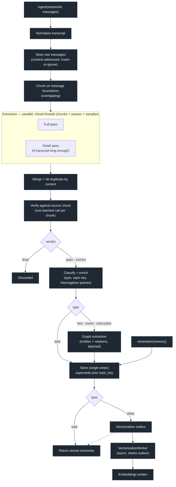
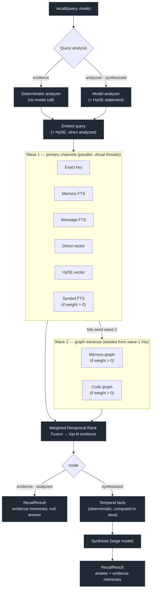

# Pieria

**A local-first, persistent memory layer for AI agents.**

[](https://github.com/VAlux/pieria/actions/workflows/release.yml)

> *Pieria* — the region at the foot of Mount Olympus that was the mythic home of the
> Muses and the site of the Pierian spring, the classical metaphor for the source of
> knowledge and memory.

Pieria gives your AI coding tools a shared, long-lived memory. You install it once, it
runs as a background daemon on `localhost`, and every MCP-capable agent on your machine —
Claude Code, OpenCode, Codex, and others — reads and writes the same memory store. What
one tool learns, the next one already knows.

It runs entirely on your own machine. No cloud account, no API key, and no network
round-trip are required for a recall: the default setup pairs an embedded database with a
local model runtime (Ollama). Any OpenAI-compatible endpoint works — LM Studio, llama.cpp,
vLLM, OpenRouter, OpenAI, Azure OpenAI — and a multi-user server mode is opt-in, the same
code with a different backend.

---

## Why Pieria

AI agents forget everything between sessions, and their context windows fill up. Pieria is
the durable memory that survives compaction and restarts:

- It **extracts** durable knowledge from agent conversations — facts, events, instructions,
  and tasks — instead of forcing the agent to keep everything in context.
- It **deduplicates and supersedes** memories so the store stays accurate as it grows,
  rather than accumulating stale or contradictory entries.
- It **retrieves** the relevant subset on demand through fused multi-modal search, and
  returns a synthesized natural-language answer.

## Features

- **Local-first & private** — runs offline by default; nothing leaves your machine.
- **Shared across tools** — one memory store serves every MCP harness simultaneously.
- **Structured memory** — every memory is classified as a `fact`, `event`, `instruction`,
  or `task`, with per-type fields.
- **Smart ingestion** — content-addressed IDs make ingest idempotent; parallel extraction,
  verification, classification, and supersession keep the store clean.
- **Multi-modal retrieval** — seven parallel channels (memory full-text search, exact key
  lookup, raw-message search, direct vector, HyDE vector, symbol search, and graph
  traversal) fused with weighted Reciprocal Rank Fusion.
- **Knowledge graph** — ingestion extracts entities and relations alongside memories, so
  recall can traverse from a first-wave hit to what it's connected to.
- **Code intelligence** — `pieria onboard --source-code` builds a tree-sitter symbol and
  call graph over Java, Kotlin, Scala, JavaScript/TypeScript, SCSS, Python, Go, Rust, Ruby, PHP,
  C#, C/C++, and Swift, making the codebase itself a
  retrieval channel.
- **Tunable recall cost** — three inference tiers (`evidence`, `analyzed`, `synthesized`)
  trade latency and model calls against answer richness, per call or per profile.
- **Deterministic temporal reasoning** — date math is computed in code, not guessed by a
  model.
- **Vendor-neutral & exportable** — your memories export to NDJSON; swap model providers or
  scale up to a shared Postgres server without a rewrite.

## How it works

```
  Agent harnesses ──► MCP stdio gateways ─┐
  (any MCP harness)    (thin clients)     │
                                          ├─► Local daemon ──► Embedded store (SQLite + vec + FTS5)
  pieria CLI ─────────────────────────────┘  (binds 127.0.0.1)  └─► Models (Ollama, default)
  (onboard / config / tasks)
```

A single background **daemon** owns the embedded database and pipelines and binds an HTTP
API to `127.0.0.1`. Each harness launches a tiny **MCP stdio gateway** that forwards tool
calls to the daemon. Because the embedded database is single-writer, funnelling every
harness through one daemon both avoids write-lock contention and delivers the shared-memory
goal. The `pieria` CLI is a third, short-lived client of the same HTTP API.

The daemon runs two pipelines over a pluggable storage backend:

- **Write path (ingest):** conversation → normalize → chunk → parallel unified extraction
  (memory plus classification) → verification against the source chunk → optional correction
  reclassification → graph extraction → supersession → store → async
  vectorization. The call returns before vectorization completes; a virtual-thread worker
  drains the outbox.
- **Read path (recall):** query analysis + embedding → parallel retrieval channels →
  weighted RRF fusion → deterministic temporal facts → synthesis.

Long-running work (onboarding, code indexing, reminiscence, async ingest) is submitted as a
**daemon task** and polled — `pieria task list` shows what's in flight. Progress is reported only
as an ordered `lanes` array. Each lane has a stable name, state (`QUEUED`, `RUNNING`, `WAITING`,
`COMPLETED`, `FAILED`, or `CANCELLED`), phase, counters, and phase-start timestamp. Async ingest uses
`ingest`, direct code indexing uses `code`, and graph/reminiscence work uses `graph`. Onboarding uses
only the applicable `content` and/or `code` lanes: mixed plans run both concurrently, code summaries
wait for content, and graph enrichment is considered only after both lanes finish.

### Ingestion pipeline



Each chunk is verified, classified, graph-extracted, and stored before the next one starts, so an
interrupted ingest keeps every memory it finished. The call returns once the last chunk is stored —
`OB -.-> DONE` marks that vectorization is enqueued, not awaited. `task` memories skip both graph
extraction and the vector index; explicit `remember` writes join at the store stage, bypassing the
model entirely.

> **Extraction is stochastic:** `--extraction-samples n` repeats each pass `n` times per chunk and
> unions the results, catching more facts at proportionally more model calls.

### Retrieval pipeline



**Recall tiers.** Each tier is a superset of the one above it, so a caller trades latency and
inference cost against answer richness:

| Mode | Query analysis | Synthesis | Typical latency |
|------|----------------|-----------|-----------------|
| `evidence` | Deterministic (no model call) | No — `null` answer | ~1–3 s |
| `analyzed` | Model-driven, plus HyDE | No — `null` answer | seconds |
| `synthesized` (default) | Model-driven, plus HyDE | Yes — large model | tens of seconds |

The auto-recall injection hooks use `evidence`. Set a profile-wide default with
`pieria.retrieval.recall-mode` in `.pieria/config.toml`, or override per call via the
`mode` field on `POST /recall` and the `recall` MCP tool.

> **Channel failure is graceful:** a critical local-storage channel (FTS / exact-key) failing
> aborts the recall, while a best-effort vector or graph channel that fails or exceeds
> `channel-timeout-ms` is logged and contributes nothing.

## Stack

- **Java 25**, **Spring Boot 4.0.6**, Gradle (Kotlin DSL)
- **Spring AI** for provider-agnostic chat + embeddings over any OpenAI-compatible endpoint
  (Ollama default) or Azure OpenAI
- **SQLite + sqlite-vec + FTS5** embedded backend (default); **PostgreSQL + pgvector** for server mode
- **tree-sitter** for the source-code symbol and call-graph index
- **picocli** for the CLI, **Flyway** migrations, **JUnit 5** tests, **GraalVM native-image**
  packaging (JVM fallback)

The repository is split into Gradle modules under `modules/`:

| Module    | Responsibility                                                        |
|-----------|-----------------------------------------------------------------------|
| `shared`  | HTTP DTOs, the daemon HTTP client, config model + TOML codec, `ProfileResolver`. |
| `daemon`  | REST controllers, domain, storage, ingestion, retrieval, code index, model gateway. |
| `gateway` | stdio MCP tools that forward to the daemon.                          |
| `cli`     | the `pieria` command — harness wiring, onboarding, profiles, tasks, self-update. |
| `eval`    | offline evaluation harness — fixtures, runner, benchmark adapters.    |

---

## Installation

### Quick install (macOS / Linux)

The installer downloads the native `pieria`, `pieria-daemon`, and `pieria-gateway` binaries
for your platform, links them onto your `PATH`, and registers the daemon as a per-user OS
service (launchd on macOS, systemd on Linux). Re-running is safe — every step is idempotent.

```bash
curl -fsSL https://raw.githubusercontent.com/VAlux/pieria/main/packaging/install.sh | bash
```

> Inspect any script before piping it to a shell. You can also download `install.sh` and run
> `bash install.sh --dry-run` to preview every step and resolved URL without changing anything.

Useful flags:

```bash
bash install.sh --no-service     # install binaries only, skip OS service registration
bash install.sh --version vX.Y.Z # pin a specific release tag
bash install.sh --help           # full option list
```

**Windows:** use the PowerShell installer instead:

```powershell
packaging/install.ps1
```

Once installed, the daemon listens on `http://127.0.0.1:8077`. On first start it
initializes the embedded database, runs migrations, and prints guidance for pulling the
default Ollama models if they are absent.

### Wire a harness

From inside a project, register the MCP gateway and lifecycle hooks for your tool:

```bash
pieria harness install claude-code        # or: codex, opencode
pieria harness install claude-code --user # wire ~/.claude instead of this repo
```

Preview, inspect, or undo:

```bash
pieria harness install claude-code --dry-run   # preview the changes first
pieria harness list                            # see what's wired
pieria harness uninstall claude-code           # undo
```

Installing wires three things: the MCP gateway server, the lifecycle hooks (session-start
recall injection, PreCompact/Stop ingest), and `/pieria-recall` + `/pieria-remember` slash
commands. The hooks fail closed — if the daemon or the model provider is unreachable they
silently no-op rather than blocking your session.

The default convention is **profile-per-repo**: the profile name is derived from the git
remote or project directory, so pointing every harness at the same profile gives shared
memory across tools.

### Seed the profile from project sources

A fresh profile starts empty, so `recall` returns nothing until a few sessions have
accumulated. `pieria onboard` solves this cold start by seeding the profile from sources you
already have:

```bash
pieria onboard                         # content + source-code lanes (the default), run concurrently
pieria onboard --content               # content lane only: markdown, text, PDF, and web
pieria onboard --source-code           # code lane only: tree-sitter symbol and call-graph index
pieria onboard --content --source-code # explicit equivalent of the default
pieria onboard --dry-run               # list the sources that would be sent, contact nothing
```

The bundled Tree-sitter language packs support: C, C++, C#, Go, Java, JavaScript, Kotlin, PHP,
Python, Ruby, Rust, Scala, SCSS, Swift, TypeScript, and TSX. Plain CSS and indented Sass are not
parsed. After upgrading Pieria to a release with new or updated language packs, run
`pieria onboard --source-code --reindex` once so previously indexed files are rebuilt with the
installed grammars.

Local native installations built with `./gradlew :daemon:deployLocal` compile and bundle the same
pinned grammar set used by release artifacts; no manual grammar installation is required.

With no positional argument it scans the project directory. Give it **targets** and it
onboards only those, dispatching each by type:

```bash
pieria onboard docs/SPEC.md               # a single content-only .md / .txt / .pdf file
pieria onboard ./docs ./adr               # directories: content + code by default
pieria onboard https://example.com/guide  # a content-only http(s) URL → fetched web page
```

Source-code selection requires directory targets. Individual document files and URLs participate
only in the content lane; code-only mode warns and skips them, and exits with status 2 without
contacting the daemon when no directory target remains. “All” always means all applicable lanes, so
file and URL targets stay content-only even with the default or both selectors.

Documents are enumerated via `git ls-files` (so build output and gitignored files are
skipped) and run through the normal ingest pipeline — the daemon's extraction, verification,
and supersession keep low-signal content out. `CLAUDE.md` and `AGENTS.md` are excluded by
default since harnesses already load them into context every session; pass
`--include-agent-docs` to seed them too. Re-running is idempotent: unchanged content adds no
duplicate memories.

Useful flags:

| Flag | Effect |
|------|--------|
| `--content` | Select markdown, plain-text, PDF, and web onboarding only. |
| `--source-code` | Select only the symbol + call-graph index from directory targets. With `--content`, explicitly select both lanes. |
| `--summarize` | After indexing, write LLM-synthesized architecture and per-module summary memories. |
| `--reindex` | Re-parse every source file even if unchanged. Use after a parser upgrade. |
| `--refresh` | Re-ingest content documents even if unchanged. |
| `--extraction-samples <n>` | Run `n` independent extract passes per chunk and union the results. Extraction is stochastic, so more samples catch more facts — at proportionally more model calls. |
| `--include-agent-docs` | Also seed `CLAUDE.md` / `AGENTS.md`. |
| `--no-enrich-graph` | Finish core onboarding without scheduling graph enrichment. |
| `--wait-for-enrichment` | Wait for the graph child task too (mutually exclusive with `--no-enrich-graph`). |
| `--profile`, `--daemon-url`, `--config-dir` | Standard overrides. |

The CLI pushes project profile overrides first, then submits every selected source as one daemon
task. The daemon derives content and code lanes from that source list and runs both concurrently when
both apply. “Core ready” means raw messages are searchable, extracted memories are verified and
stored, and non-task memories are queued for embedding. Embeddings drain asynchronously and may
briefly show as a stats backlog. Graph extraction runs in a separate `onboard-graph` child task by
default; the CLI prints its id and exits successfully without waiting. If the daemon restarts
mid-enrichment, the orphan rows remain available to a later `pieria reminisce` run.

Each source is isolated from the next: if markdown, text, PDF, web, or source-code onboarding fails,
the daemon logs the full failure and continues with the remaining sources. The terminal task result
contains an `errors` list, and the CLI prints the complete list after reporting successful sources;
partial onboarding exits with status 1 so automation does not mistake it for complete success.

> Requires the daemon to be running and a model provider reachable.

### Weave orphan memories into the graph

Memories written directly (via the `remember` tool, or `pieria profile remember`) skip the
ingest pipeline's graph-extraction stage, so they land in the store with no entity-relation
edges — invisible to the graph retrieval channel. `pieria reminisce` retroactively adopts
them:

```bash
pieria reminisce             # extract graph fragments for every edgeless memory
pieria reminisce --dry-run   # count the orphans a run would adopt; no model calls
```

Adoption runs as a background daemon task and is model-heavy, batched to keep each
`extractGraph` call inside the model's context window. Run it after a bulk `remember` spree,
or occasionally as maintenance.

### Update

One command replaces the installed binaries and restarts the daemon — no manual copying, service
juggling, or Gatekeeper workarounds:

```bash
pieria update                 # download the latest release for this platform, swap, restart
pieria update --version vX.Y.Z   # pin a release tag
pieria update --dry-run       # show exactly what would happen, change nothing
```

It acquires the new distribution first (so a failed download never leaves you serviceless), stops
the daemon, atomically swaps the binaries, restarts the daemon, and waits for it to come healthy.
On macOS it clears the quarantine attribute and ad-hoc-signs the binaries so they aren't blocked by
Gatekeeper. A daemon restart is transparent to a running Claude Code session (the gateway reconnects
over HTTP) — the lifecycle hooks live inside the `pieria` binary itself, so swapping it updates them
automatically; you only need to relaunch the harness if the **gateway binary** changed. (Currently
macOS-only; on other platforms re-run the installer.)

### Build from source

Requires JDK 25 (and GraalVM 25+ for native images).

```bash
./gradlew build                 # compile + test + assemble
./gradlew test                  # run the full test suite
./gradlew :daemon:bootRun       # run the daemon locally
./gradlew :daemon:bootJar       # → modules/daemon/build/libs/pieria.jar
./gradlew :gateway:bootJar      # → modules/gateway/build/libs/pieria-gateway.jar
./gradlew :daemon:nativeCompile # GraalVM daemon executable
./gradlew :gateway:nativeCompile
./gradlew :cli:nativeCompile
./gradlew :daemon:nativeDist    # assemble the full native distribution
```

For the local dev loop, `./gradlew :daemon:deployLocal` builds the native distribution and syncs it
into `$PIERIA_HOME`, updating your installed Pieria in one step. It is slow and overwrites the
installed binaries — `./gradlew test` is the fast way to check a change.

---

## Usage

### MCP tools

Harnesses interact through four model-facing MCP tools:

| MCP tool   | Purpose                                                              |
|------------|----------------------------------------------------------------------|
| `recall`   | Run retrieval; returns a synthesized answer, or raw evidence in the cheaper `mode` tiers. |
| `remember` | Store a single memory explicitly (bypasses the model pipeline).      |
| `list`     | List memories (filter by type/session).                              |
| `forget`   | Mark a memory as no longer valid.                                    |

`ingest` is deliberately **not** a tool. Bulk ingestion is driven by harness lifecycle hooks
(at compaction, on stop, at session end), so the primary agent never burns context designing
storage queries.

### Command line

```bash
pieria status | start | stop | restart | logs      # daemon lifecycle
pieria harness install | uninstall | list          # wire an agent harness
pieria onboard [TARGET...]                         # seed a profile from docs / PDFs / URLs / code
pieria reminisce                                   # adopt orphan memories into the graph
pieria task [<id>] | task list | task kill <id>    # inspect and control daemon tasks
pieria config show | config sync                   # inspect / push layered configuration
pieria update                                      # self-update binaries and restart
```

Profile management and direct store access live under `pieria profile`:

```bash
pieria profile list                    # every profile the daemon knows about
pieria profile resolve                 # which profile this directory maps to
pieria profile create <name>           # create an empty profile
pieria profile delete <name>           # delete a profile and all its memories
pieria profile stats <name>            # counts, storage, and inference spend
pieria profile memories <name>         # list memories (filter by type/session)
pieria profile recall <name> <query>   # run retrieval from the shell
pieria profile remember <name> ...     # store one memory explicitly
pieria profile forget <name> <id>      # mark a memory invalid
pieria profile audit <name>            # search profile calls, callers, and Pieria outputs
pieria profile export <name>           # export all memories as NDJSON
```

### REST API

The daemon exposes an HTTP API on `127.0.0.1:8077`. Most routes are scoped by profile.

| Method | Path                                  | Purpose                                     |
|--------|---------------------------------------|---------------------------------------------|
| GET    | `/v1/profiles`                        | List profiles.                              |
| PUT    | `/v1/profiles/{name}`                 | Create a profile.                           |
| DELETE | `/v1/profiles/{name}`                 | Delete a profile and its memories.          |
| POST   | `/v1/profiles/{name}/ingest`          | Bulk-extract memories from a conversation.  |
| POST   | `/v1/profiles/{name}/ingest/transcript` | Stream a transcript as NDJSON.            |
| POST   | `/v1/profiles/{name}/ingest/async`    | Same, submitted as a background task.       |
| POST   | `/v1/profiles/{name}/memories`        | Store a single memory explicitly.           |
| POST   | `/v1/profiles/{name}/recall`          | Run retrieval (JSON, or `text/plain`).      |
| GET    | `/v1/profiles/{name}/memories`        | List memories (filter by type/session).     |
| DELETE | `/v1/profiles/{name}/memories/{id}`   | Forget a memory.                            |
| GET    | `/v1/profiles/{name}/stats`           | Counts, storage, and inference spend.       |
| GET    | `/v1/profiles/{name}/graph`           | The entity-relation graph as JSON.          |
| GET    | `/v1/profiles/{name}/graph/view`      | A browsable HTML view of the graph.         |
| GET    | `/v1/profiles/{name}/export`          | Export all memories (NDJSON).               |
| GET    | `/v1/profiles/{name}/audit`           | Search cursor-paginated profile audit events. |
| GET    | `/v1/profiles/{name}/audit/{id}`      | Read one event with retained request/response bodies. |
| GET/PUT/DELETE | `/v1/profiles/{name}/config`  | Read, push, or clear per-profile overrides. |
| POST   | `/v1/profiles/{name}/code`            | Index source files (deterministic, model-free). |
| POST   | `/v1/profiles/{name}/code/async`      | Index as a background task, optional summarization. |
| GET    | `/v1/profiles/{name}/code/status`     | Code-index counts.                          |
| POST   | `/v1/profiles/{name}/onboard/async`   | Onboard an ordered source plan; graph enrichment becomes a child task. |
| POST   | `/v1/profiles/{name}/reminisce/async` | Adopt orphan memories as a background task. |
| GET    | `/v1/profiles/{name}/reminisce/orphans` | Count edgeless memories (no model call).  |
| GET/DELETE | `/v1/tasks`, `/v1/tasks/{id}`     | List, inspect, and cancel daemon tasks.     |
| GET    | `/pieria-health`, `/pieria-status`    | Liveness and daemon status.                 |

Task status and task-list entries intentionally have no root-level scalar progress fields. Their
progress contract is:

```json
{
  "status": "RUNNING",
  "lanes": [
    {
      "name": "content",
      "state": "RUNNING",
      "phase": "source 1/2 markdown: extract",
      "done": 3,
      "total": 8,
      "phaseStartedAtEpochMs": 1784650000000
    },
    {
      "name": "code",
      "state": "WAITING",
      "phase": "waiting for content",
      "done": 42,
      "total": 42,
      "phaseStartedAtEpochMs": 1784650001000
    }
  ]
}
```

Every profile-scoped call except audit browsing itself is appended to the profile's audit history.
Events include request correlation, operation, caller/harness/channel, timing, status, errors, and
request/response payloads. Pieria retains the first 1 MiB of each body by default while hashing and
counting the complete byte stream; configure the cap with `pieria.audit.max-body-bytes`. Async work
adds a linked terminal event with its result. Deleting a profile also deletes its audit history.

Pieria's gateway, CLI, console, and installed hooks declare their identity with `X-Pieria-Client`,
`X-Pieria-Harness`, `X-Pieria-Channel`, and `X-Pieria-Client-Version`. These headers provide useful
local attribution, not authenticated identity; untagged callers appear as direct API access.

Example recall:

```http
POST /v1/profiles/my-project/recall
{ "query": "What package manager does the user prefer?", "mode": "synthesized" }

200 OK
{ "answer": "The user prefers pnpm over npm.", "memories": [ ... ] }
```

Onboarding request body:

```json
{
  "sources": [
    { "type": "markdown", "root": "/abs/project", "includeAgentDocs": false },
    { "type": "source-code", "root": "/abs/project", "reindex": false }
  ],
  "enrichGraph": true
}
```

The terminal core task result contains per-source and aggregate counts plus optional
`graphEnrichmentTaskId` and `graphCandidates` fields.

---

## Configuration

The daemon binds to `127.0.0.1` by default and never exposes a public interface in local
mode. The embedded database and config live under an OS-appropriate data directory
(`~/.local/share/pieria/` by default).

### Layers

Configuration is resolved in three layers, most specific winning:

1. **Code defaults** — the daemon's built-in `application.properties`.
2. **Global config** — `config.toml` in the OS config directory (`$PIERIA_CONFIG_DIR` to
   override). Process-global settings live only here: provider connection, embedding model
   and dimension, database path, daemon host/port, the vectorization worker.
3. **Project config** — `.pieria/config.toml` in the repo. Only the request-time tuning
   subset (`[pieria.ingestion]`, `[pieria.retrieval]`) is accepted here; the daemon
   whitelists it and rejects anything else.

`pieria config sync` deep-merges the global and project layers and pushes the result to the
daemon as this profile's overrides. `pieria config show` prints what the daemon is actually
using for the current profile.

### Models

Model access sits behind a swappable gateway with two tiers — a small/fast model for the
structured stages (extract, verify, classify, graph, query analysis) and a larger model for
synthesis only — plus a separate embedding model.

```properties
pieria.provider.base-url=http://127.0.0.1:11434   # API root, without /v1
pieria.provider.type=openai                       # openai (any compatible endpoint) | azure
pieria.provider.api-key=ollama                    # local providers ignore this
pieria.model.extraction-model=qwen3.5:9b-mlx
pieria.model.synthesis-model=gemma4:12b-mlx
pieria.model.embedding=mxbai-embed-large
pieria.model.embedding-dimension=1024             # fixes the vector column width — set once
```

Any OpenAI-compatible endpoint works by pointing `base-url` at it: LM Studio, llama.cpp,
vLLM, OpenRouter, OpenAI itself. For Azure OpenAI set `pieria.provider.type=azure`, use the
resource endpoint as `base-url`, and give deployment names as the `pieria.model.*` values.

Reasoning is controlled per stage: off for the structured stages, on for synthesis
(`pieria.model.reasoning.*`). Setting `logging.level.dev.alvo.pieria.model=DEBUG` in the
runtime `pieria.properties` traces each model call with stage, model, prompt size, and
latency — the fastest way to watch a slow onboarding ingest make progress.

`pieria.model.max-concurrent-structured-calls` (default `4`) is a fair daemon-wide admission
limit for extraction-tier HTTP attempts (`extract`, `verify`, `classify`, graph extraction, and
query analysis). Per-ingest `max-extraction-concurrency` still controls local fan-out; the global
limit caps aggregate work across simultaneous tasks. Embedding and synthesis use separate tiers
and are not included.

> **Changing `embedding-dimension` invalidates every stored vector.** Decide it once, before
> you accumulate memories, or you'll have to re-embed the whole store.

### Retrieval tuning

Each channel carries a weight; setting a weight to `0` disables that channel entirely. The
graph and code channels are the usual ones to turn off if you haven't run
`onboard --source-code` or `reminisce`.

```toml
# .pieria/config.toml
[pieria.retrieval]
recall-mode = "analyzed"    # profile-wide default tier
weight-exact-key = 3.0      # exact topic-key hits dominate
weight-fts-memory = 1.0
weight-direct-vector = 1.0
weight-hyde-vector = 1.0
weight-fts-message = 0.5    # raw messages are noisy — deliberately down-weighted
weight-graph = 1.0
weight-symbol-fts = 1.0
weight-code-graph = 1.0
channel-timeout-ms = 3000
```

### Spend

`pieria profile stats` shows the tokens Pieria actually spent, per tier. Fill in your
provider's prices (`pieria.stats.spend.<tier>.{input,output}-price`, dollars per 1M tokens)
and it costs them too; left at `0.0`, only token counts show.

## Data portability

Every memory is exportable via `GET /export` as newline-delimited JSON. Your memories are
yours — and the same export is the migration path to server mode: export from SQLite,
import into Postgres, re-embed.
