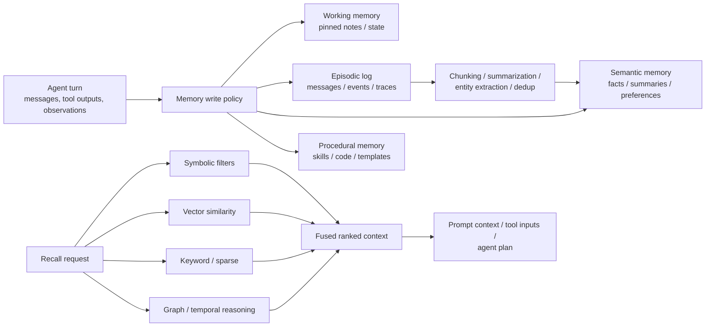

# Agentic Memory Management Systems

## Executive summary

Provider-agnostic and harness-agnostic **agentic memory** now falls into two broad layers. The first is a **memory
middleware / memory API** layer that decides *what* to remember and *how* to recall it for an agent; this includes
systems such as Mem0, Zep, Graphiti, Letta, Memori, Cognee, Supermemory, and Hindsight. The second is a **storage
substrate** layer—vector databases, SQL/graph databases, search engines, and local-first stores—that persists
embeddings, facts, events, or documents, but usually leaves summarization, forgetting, versioning, and write policies to
the application layer. Official docs across these products consistently reflect that split.

For **coding agents or harnesses** that need long-lived project memory—project notes, conventions, tool outputs,
decisions, failures, and user preferences—the most portable integration boundary today is usually **MCP** or **REST/HTTP
**. Mem0 exposes SDKs, REST, and MCP; Graphiti exposes an MCP server; Cognee offers MCP plus HTTP/Python APIs; Memori
offers SDKs and MCP; Supermemory offers SDKs and MCP; Hindsight offers SDKs, HTTP, and local/hosted MCP; and the
official MCP memory server provides a minimal local knowledge-graph memory server. That means you can usually add memory
to Codex-like harnesses, Claude Code, Cursor, OpenClaw, Hermes, or custom agents without binding yourself to one LLM
provider.

The solutions that look strongest for **general-purpose agent memory infrastructure** are Zep, Hindsight, Mem0, Memori,
Cognee, and Supermemory. They differ mainly in what they optimize for. Zep and Graphiti emphasize **temporal knowledge
graphs** and context assembly. Hindsight emphasizes **multi-strategy recall** plus a higher-level `reflect()` reasoning
mode. Mem0 emphasizes a lightweight, pluggable memory API with hybrid retrieval and deletion/expiration policies. Memori
emphasizes **memory from execution traces**, not just chat transcripts. Cognee emphasizes a **control plane** spanning
relational, vector, graph, and session stores. Supermemory emphasizes managed personalization, document/content
ingestion, connectors, and a graph-based memory layer.

If your team wants the most **portable and infrastructure-light** route, use a memory API or MCP server. If you want the
most **control** and already have data infrastructure, combine a storage substrate like PostgreSQL + pgvector, Redis,
Qdrant, Weaviate, LanceDB, Neo4j, OpenSearch, or Elasticsearch with your own memory write/read policy. The tradeoff is
simple: **middleware buys curation and recall policy; databases buy control and performance**.

## Scope and evaluation framework

I treated a system as “agentic memory” if it enables an agent to **write persistent or session memory during operation**
and later **read or retrieve that memory during subsequent work**. That includes persistent user/project memory,
task/session state, tool outputs, execution traces, summaries, facts, preferences, or shared team context.

I prioritized systems that are **provider-agnostic** and **harness-agnostic**, meaning they can be used outside any
single LLM vendor or agent framework. I therefore favored products that expose one or more of these boundaries: *
*REST/HTTP APIs, gRPC APIs, SDKs in general-purpose languages, or MCP servers**. I did **not** prioritize
framework-bound memory modules unless the vendor also exposes a standalone API, SDK, or MCP/server boundary.

Attributes in the comparison tables are marked **Unspecified** when I could not verify them from the primary sources I
used. That matters especially for conflict resolution, exact storage internals, fine-grained security controls, and
air-gapped deployment options, which many vendors do not document on their public pages.

The architecture that best fits most real-world agents looks like this:

That pattern aligns closely with the classic research direction from **Generative Agents** and **MemGPT**, and with
modern product designs such as Letta’s memory blocks plus archival memory, Hindsight’s mental-model/observation/fact
hierarchy, and Zep/Graphiti’s episode-to-graph pipeline.

## Memory middleware and memory APIs

The systems below are the most important **memory-specific** solutions I could verify from primary sources. They are the
closest fit to your definition of “agentic memory management.”

| Solution                       | Type and deployment                                                                                        | Storage types                                                                                                                                          | Retrieval methods                                                                                                                                                                          | Embedding or model agnosticism                                                                                                               | Interfaces                                                      | Persistence and scale                                                                                                 | Privacy, security, offline                                                                                                  | Curation, forgetting, versioning                                                                                                                                 | Best-fit use cases                                                                         |
|--------------------------------|------------------------------------------------------------------------------------------------------------|--------------------------------------------------------------------------------------------------------------------------------------------------------|--------------------------------------------------------------------------------------------------------------------------------------------------------------------------------------------|----------------------------------------------------------------------------------------------------------------------------------------------|-----------------------------------------------------------------|-----------------------------------------------------------------------------------------------------------------------|-----------------------------------------------------------------------------------------------------------------------------|------------------------------------------------------------------------------------------------------------------------------------------------------------------|--------------------------------------------------------------------------------------------|
| **Mem0**                       | OSS library plus managed platform; self-hosted OSS and hosted platform                                     | Vector DB plus entity-linked memory; configurable LLMs, embeddings, vector DBs, rerankers; platform docs also expose REST server and platform features | Multi-signal hybrid retrieval: semantic + BM25 keyword + entity matching; reranker support; multimodal memory ingestion                                                                    | **Yes** for LLMs, embeddings, and vector DBs                                                                                                 | Python, TypeScript, REST API server, MCP                        | Persistent scoped memories by `user_id`, `agent_id`, `app_id`, `run_id`; platform and OSS                             | Self-hosting supported; deletion APIs and expiration policies documented                                                    | Built-in extraction, metadata filtering, deletion, expiration; OSS docs show entity linking replacing older graph-store support; versioning unspecified          | Lightweight memory layer for assistants, support bots, general agents, coding helpers      |
| **Zep**                        | Managed memory/context platform with cloud and enterprise deployment options                               | Temporal knowledge graph over chat history, business data, messages, and JSON data                                                                     | Graph search combines semantic similarity, BM25 full-text, optional breadth-first bias, and context assembly                                                                               | **Partial**: Zep Cloud supports BYOM and BYOK; public docs emphasize provider flexibility, not generic embedder plumbing                     | Python, TypeScript, Go SDKs, webhooks, API docs                 | Sub-200ms retrieval claim; batch ingestion; shared graphs/users/groups                                                | SOC 2 Type II, HIPAA, RBAC, audit logging, BYOK, BYOC, BYOM                                                                 | Facts, observations, summaries, context templates, temporal invalidation of facts; conflict/versioning unspecified                                               | Enterprise personalization, customer/service agents, compliance-heavy systems              |
| **Graphiti**                   | Open-source Python framework from Zep                                                                      | Neo4j or FalkorDB-backed temporal knowledge graph                                                                                                      | Hybrid search combining semantic, keyword, graph, and time-aware retrieval                                                                                                                 | **Yes** for multiple LLM providers; supports Azure OpenAI, Gemini, Anthropic, Groq, Ollama, and multiple embedding options in MCP setup      | Python SDK, MCP server                                          | Real-time incremental knowledge-graph updates without batch recomputation                                             | Self-hosted; telemetry can be disabled; local DBs supported                                                                 | Episode ingestion, custom entities/ontology, graph maintenance; versioning/conflict resolution unspecified                                                       | Temporal, relationship-heavy memory for agents and assistants                              |
| **Letta API and Letta Code**   | Open-source stateful agent platform plus cloud features; can self-host Docker or run local mode            | Database-backed agent state, pinned memory blocks, archival vector memory, message history; Letta Code adds git-backed MemFS                           | In-context pinned memory, semantic archival search, message-history search                                                                                                                 | **Yes**: Letta API and Letta Code support many remote and local providers, plus BYOK                                                         | REST, Python SDK, TypeScript SDK, desktop app, CLI, hooks       | Agents persist in a database; shared memory blocks update across agents in real time; local and cloud-managed state   | Local mode stores state on your machine; self-host Docker; HTTPS / remote hosting options documented                        | Editable memory blocks, shared memory, archival insert/search, git-backed MemFS with version history and conflict resolution                                     | Long-lived personal/coding agents, multi-agent coordination, editable project memory       |
| **Memori**                     | Open-source memory infrastructure plus managed cloud and BYODB                                             | SQL-native persistent state; official docs position it as memory over your existing database and infrastructure                                        | Structured recall over conversations and execution traces; official docs emphasize “advanced augmentation” plus agent-controlled recall; exact index internals partly unspecified publicly | **Yes**: official README positions it as LLM-, datastore-, and framework-agnostic                                                            | Python SDK, TypeScript SDK, MCP, OpenClaw plugin, Hermes plugin | Persistent attribution by entity/process/session/project; cloud dashboard includes recall analytics and quota metrics | BYODB / “all data stays on your infrastructure” documented; cloud also available                                            | Automatically structures conversations and execution trace into attributes, events, facts, preferences, rules, relationships, and skills; versioning unspecified | Tool-using agents, coding agents, workflow/execution memory, production observability      |
| **Cognee**                     | Open-source “memory control plane” plus Cognee Cloud                                                       | Relational DB + vector store + graph store + session/cache layers; configurable providers                                                              | Graph + vector retrieval; `remember`, `recall`, `forget`, `improve`; MCP memory tools include permanent and session memory                                                                 | **Yes** for LLM providers, embedding providers, relational DBs, vector stores, and graph stores; local backends supported                    | Python SDK, HTTP API, MCP                                       | Standalone mode or API/shared mode; cloud SDK routes all operations to tenant; Postgres recommended for production    | Self-hosted local mode requires no API key; permissions, dataset isolation, access control, and on-prem offering documented | Built-in chunking, summarization, graph extraction, permissions, `forget`, `improve`; versioning is manual per docs                                              | Multi-source enterprise memory, shared project memory, graph-enhanced recall               |
| **Supermemory**                | Managed API plus MCP; self-hosting on Scale/Enterprise, fully air-gapped on Enterprise                     | Managed memory graph over text, files, URLs, docs, and synced connector content                                                                        | Search memories, build user profiles, graph memory, metadata filtering, hybrid patterns; memories evolve via `updates`/`extends`                                                           | **Partial / Unspecified**: provider-agnostic positioning is clear, but public docs are lighter on raw embedder pluggability than OSS systems | Python SDK, TypeScript SDK, cURL/REST, MCP, connectors          | Real-time connector sync is documented; hosted API pricing is usage-based                                             | Self-hosted deployments on Scale and Enterprise; fully air-gapped Enterprise documented                                     | Automatic extraction and indexing, user profiles as real-time compaction, graph-based memory evolution, bulk delete, container tags                              | SaaS personalization, content-heavy assistants, MCP-connected tools and coding assistants  |
| **Hindsight**                  | Open-source memory system plus managed cloud; can self-host free or run local MCP with embedded PostgreSQL | PostgreSQL-backed memory banks; local MCP uses embedded PostgreSQL (`pg0`)                                                                             | Four parallel retrieval strategies: semantic, keyword/BM25, graph traversal, and temporal; plus `reflect()` for agentic reasoning                                                          | **Yes**: docs expose Python, TypeScript, Go, CLI, HTTP, MCP, and local/provider settings including Ollama                                    | Python, TypeScript, Go, CLI, HTTP, MCP                          | Persistent memory banks; local MCP persists in `~/.pg0/...`; cloud is pay-as-you-go                                   | Local-first/offline self-hosting supported; bank scoping and local MCP emphasize privacy                                    | Observation consolidation, mental models, directives, disposition, citations, history-preserving updates; strong write/read semantics                            | Coding agents, team-shared project memory, self-improving agents, privacy-sensitive setups |
| **Official MCP Memory Server** | Official MCP reference server, not positioned as production-ready                                          | Local knowledge graph memory                                                                                                                           | Symbolic / knowledge-graph memory operations                                                                                                                                               | **N/A / no embedding dependency required**                                                                                                   | MCP server package (`@modelcontextprotocol/server-memory`)      | Persistent across chats in local setup                                                                                | Fully local by default; official repo explicitly says reference servers are educational examples, not production-ready      | Basic persistent memory; public docs do not specify summarization, TTL, or versioning                                                                            | Minimal local memory for Claude/Cursor-style clients and prototyping                       |

An important adjacent product is **Langbase Memory**, which positions itself as a **serverless memory/RAG API** with
intelligent reranking and agentic routing, TypeScript/Python SDKs, and millions of personalized knowledge bases. I
consider it **relevant but somewhat narrower** than the systems above because the public material leans more toward
managed RAG/document memory than toward explicit agent-state memory, shared working memory, conflict resolution, or
execution-trace memory. It is still worth considering if your memory problem is primarily document- or
knowledge-base-centric. 

## Storage engines commonly used as memory

These systems are not full “memory managers” on their own, but they are the most common **provider-agnostic substrates**
underneath memory systems. They are excellent for persistence, filtering, vector or graph retrieval, and scale. What
they usually **do not** give you by themselves is memory curation: summarization, deciding what to remember, temporal
belief updates, shared working memory, or durable skill libraries.

| Backend                   | Storage and deployment                                                       | Retrieval modes                                                                                  | Interfaces and languages                                                 | Metadata and schema                                                      | Persistence and offline                                                                  | Memory-specific helpers                                                                               | Best use                                                            | 
|---------------------------|------------------------------------------------------------------------------|--------------------------------------------------------------------------------------------------|--------------------------------------------------------------------------|--------------------------------------------------------------------------|------------------------------------------------------------------------------------------|-------------------------------------------------------------------------------------------------------|---------------------------------------------------------------------|
| **PostgreSQL + pgvector** | SQL database plus vector extension; self-hosted or managed Postgres          | Exact search, ANN, HNSW, IVFFlat; works with SQL filters and joins                               | Any language with a Postgres client                                      | Full relational schema, joins, filters                                   | ACID, point-in-time recovery, standard Postgres ops; very strong offline/self-host story | None built in for summarization/TTL beyond what you implement in SQL/app logic                        | Existing SQL stacks; durable factual/project memory                 | 
| **Redis**                 | In-memory data structure store with disk persistence; OSS, Enterprise, Cloud | Vector search with metadata filters; streams for append-only event logs                          | Broad client ecosystem; official docs list many client libraries         | Text, numeric, geospatial, tag metadata; key/value and stream structures | RDB and AOF persistence; self-host and cloud                                             | TTL/expiration, streams, Pub/Sub, locks—very useful primitives for session memory and real-time state | Ultra-low-latency working/session memory and event logs             | 
| **Qdrant**                | Dedicated vector DB; self-hosted or Qdrant Cloud                             | Dense, sparse, multivector, hybrid queries, payload filtering, custom scoring                    | REST and gRPC; official Python, JavaScript, Rust, Go, Java, .NET clients | JSON payloads alongside vectors                                          | Snapshots, local or cloud deployment                                                     | Strong filter-first memory retrieval patterns; no memory curation built in                            | Custom vector memory with good filtering and operational simplicity | 
| **Weaviate**              | Open-source vector DB plus Weaviate Cloud                                    | `nearText`, `nearVector`, BM25, hybrid, filters, cross-references                                | GraphQL, REST, gRPC, official clients                                    | Stores objects and vectors; structured filtering                         | Self-host Docker/Kubernetes or managed cloud                                             | Hybrid retrieval and cross-reference modeling; memory policy still app-layer                          | Hybrid semantic + keyword memory search with structured objects     | 
| **Pinecone**              | Hosted vector DB                                                             | Dense, sparse, and hybrid search; metadata filtering                                             | Python, JavaScript, Java, Go, C#, REST and gRPC artifacts                | Metadata filters and namespaces                                          | Managed service; public docs emphasize serverless/dedicated cloud                        | Integrated embedding/reranking options exist, but no full memory curation layer                       | Low-ops managed vector memory at cloud scale                        | 
| **Milvus / Zilliz Cloud** | Open-source vector DB plus hosted Zilliz Cloud                               | Dense + sparse hybrid search, multi-vector search                                                | Python, Node.js, Go, Java; RESTful API docs also present                 | Collection schemas and metadata filters                                  | Self-host or managed cloud                                                               | Strong search substrate; memory curation remains app-owned                                            | Large-scale dedicated vector search, multimodal retrieval           | 
| **Chroma**                | Open-source local/client-server DB plus Chroma Cloud                         | Dense, sparse, hybrid, full-text, regex, metadata filters                                        | Python, TypeScript, Rust; in-memory, persistent, async HTTP clients      | Collections, metadata, schema, sparse-vector indexes                     | In-memory, persistent local client, or server mode                                       | Very easy local persistence and filtering; still not a full memory policy engine                      | Small-to-medium app memory, local development, embedded search      | 
| **LanceDB**               | Embedded OSS “disk-first” vector DB/lakehouse plus enterprise                | Vector, full-text, hybrid, reranking, filtering, SQL                                             | Python, TypeScript, Rust                                                 | Tables, namespaces, schema, metadata filters                             | Local path, object storage, enterprise remote catalogs; built on versioned Lance tables  | Built-in table/data versioning is unusually helpful for memory history and reproducibility            | Local-first or object-store-backed memory with versioned data       | 
| **Elasticsearch**         | Distributed search engine; self-managed or Elastic Cloud                     | Semantic search, vector search, hybrid search, lexical search                                    | RESTful APIs and standard Elastic clients                                | Strong document schema, metadata, filtering                              | Real-time indexing, self-host/cloud                                                      | Powerful search stack, but memory curation is up to you                                               | Search-centric enterprise memory and compliance/search workloads    | 
| **OpenSearch**            | Open-source search engine; self-managed or managed services                  | Vector, semantic, hybrid, neural sparse, multimodal search                                       | REST APIs and OpenSearch client ecosystem                                | Document schema, filters, search pipelines                               | Self-host/cloud                                                                          | Search pipelines are useful for retrieval fusion; memory write policy still app-owned                 | Existing OpenSearch shops needing hybrid memory retrieval           | 
| **Neo4j**                 | Graph DB with self-hosted and Aura options                                   | Vector indexes, graph traversal, Cypher; hybrid full-text + vector patterns in GraphRAG guidance | Bolt/Cypher and official drivers                                         | Rich graph schema and relationships                                      | Strong graph persistence, self-host/cloud                                                | Best substrate for symbolic, relational, and temporal-ish memory graphs                               | Relationship-heavy memory, GraphRAG, provenance-rich agent memory   | 

The high-level takeaway is straightforward. If you want **a database that can store memories**, many of these work. If
you want **a system that decides which facts to write, maintains user/project profiles, manages forgetting, updates
conflicting beliefs, and exposes agent-friendly tools**, you usually want one of the memory middleware systems above
rather than a bare database.

## Architectural patterns

The most robust agent memory systems converge on a **tiered architecture** rather than a single store. Research
directions such as **Generative Agents** and **MemGPT** framed this clearly: keep a current working context, maintain a
broader memory stream or archival memory, and use retrieval plus reflection/planning to surface only the most relevant
history. In product terms, Letta separates **memory blocks** from **archival memory**; Hindsight separates **mental
models**, **observations**, and **raw facts**; and Zep/Graphiti maintain **episodes** plus a temporal graph rather than
forcing all memory into unstructured chat history.

A second pattern is **raw events first, derived memory second**. Instead of writing only “facts,” systems increasingly
store messages, tool outputs, JSON payloads, and execution traces as the ground truth, then derive chunks, summaries,
entities, preferences, or observations from them. Graphiti uses episodes and incremental graph updates. Zep ingests
messages and business data with timestamps for temporal invalidation. Cognee’s pipeline explicitly chunks, summarizes,
extracts graph structure, and indexes results. Memori’s “advanced augmentation” turns conversations and execution into
structured memory. Supermemory distinguishes between raw **documents** and derived **memories** inside a living graph.
Hindsight consolidates raw facts into higher-level observations with freshness and evidence tracking.

A third pattern is **hybrid retrieval**, not vector-only retrieval. The strongest systems do not rely on embeddings
alone. Hindsight runs semantic, keyword, graph, and temporal retrieval in parallel. Zep graph search combines semantic
similarity, BM25, and graph biasing. Graphiti fuses time, full-text, semantic, and graph algorithms. Qdrant, Weaviate,
Pinecone, Chroma, LanceDB, Elastic, and OpenSearch all document some form of dense + sparse / keyword / hybrid search,
and storage vendors increasingly make this a first-class feature. The practical implication is that if your memory must
answer questions like “what changed last week?”, “where did we decide this?”, or “who is connected to this issue?”, a
pure vector-only store is usually not enough.

A fourth pattern is **governed namespaces and lifecycle controls**. Mature systems scope memory carefully: Mem0 uses
user/agent/app/run IDs, Memori uses entity/process/session attribution, Supermemory uses container tags, Hindsight uses
banks, and Cognee uses datasets and principals. For forgetting, some systems expose explicit delete and expiration APIs,
while others preserve history and mark freshness rather than overwriting. Mem0 documents delete operations plus
expiration policies. Redis offers TTL as a primitive. Letta’s MemFS is git-backed and explicitly handles sync conflicts.
Lance tables are versioned. Supermemory graph memory preserves history through `updates`/`extends` relations and
`isLatest`, and Hindsight explicitly says observations are updated rather than overwritten while retaining evidence and
history.

A fifth pattern is **procedural or skill memory**. This matters especially for coding agents. The clearest research
example is **Voyager**, which stores and retrieves executable skills, not just facts. In product land, Letta’s MemFS and
Hindsight’s bank/mental-model patterns are the closest operational analogues for coding or tool-using agents. If your
“memory” is mostly project facts, a profile/graph store works well. If your “memory” is reusable procedures, patches,
code idioms, or tool recipes, you should treat that as **procedural memory** and store it in a versionable artifact
form, not only as embeddings.

## Recommended shortlists

For **small projects and solo developers**, the cleanest options are usually **Hindsight local MCP**, **Mem0 OSS**, *
*Chroma**, **LanceDB**, or the **official MCP memory server**. Hindsight local MCP is attractive because it gives you
full memory semantics plus a local embedded PostgreSQL database and MCP connectivity. Mem0 OSS gives you an opinionated
memory layer with hybrid recall and expiration/deletion, while Chroma and LanceDB are excellent if you want to own the
memory policy yourself. The official MCP memory server is the simplest transparent prototype option, though it is
explicitly a reference implementation rather than a production server.

For **enterprise shared memory**, the strongest shortlist is **Zep**, **Cognee**, **Memori**, and **Hindsight**. Zep
stands out for compliance posture, BYOK/BYOC/BYOM, webhooks, and temporal context assembly. Cognee stands out when you
need a memory control plane spanning relational, graph, vector, and access-control layers. Memori stands out when the
agent’s **execution trace** is as important as the conversation itself. Hindsight stands out when you want self-hosting
plus richer synthesis and bank-based scoping without giving up MCP and SDK portability.

For **privacy-sensitive or air-gapped deployments**, the best-fit shortlist is **Graphiti + Neo4j/FalkorDB**, *
*Hindsight self-host or local MCP**, **Mem0 OSS**, **Cognee local/self-host**, **Memori BYODB**, and **Supermemory
Enterprise** if you prefer a vendor-managed product with air-gapped support. Graphiti, Hindsight, Mem0 OSS, and Cognee
all have strong self-host/local stories. Memori explicitly documents keeping data on your own infrastructure.
Supermemory explicitly documents fully air-gapped Enterprise deployments.

For **low-latency memory access**, prioritize **Redis**, **Zep**, **Qdrant**, **LanceDB**, and **Pinecone**. Redis is
still the best primitive for ultra-fast session state and streaming event memory. Zep is unusually explicit about
sub-200ms retrieval and real-time context assembly. Qdrant and Pinecone are strong when you need dedicated vector
infrastructure with fast retrieval and filtering, while LanceDB is particularly attractive when you can keep memory
local or close to NVMe/object-backed storage and want an embedded data path.

For **coding-agent project memory**, my shortlist is **Hindsight local MCP**, **Memori MCP**, **Graphiti MCP**, **Cognee
MCP**, **Supermemory MCP**, and **Letta Code with MemFS**. Hindsight local MCP is particularly compelling for
project-scoped bank memory and local privacy. Memori is compelling when you want the agent to remember actual execution
outcomes and tool traces. Graphiti and Cognee are compelling when code/project memory benefits from relationships and
structured recall. Supermemory is compelling when you also want cross-tool connectors and user/project profiles. Letta
Code is the best fit when you want memory that is directly editable as files and tracked with git semantics.

If I had to produce a **single practical shortlist** for most teams today, it would be:

- **Best overall memory middleware:** Hindsight, Zep, Mem0, Memori, Cognee.
- **Best for coding assistants and MCP-native workflows:** Hindsight local MCP, Memori MCP, Graphiti MCP, Cognee MCP,
  Supermemory MCP.
- **Best storage-first substrates when you want to build your own semantics:** PostgreSQL + pgvector, Redis, Qdrant,
  LanceDB, Neo4j.
- **Best “editable/project note” memory model:** Letta Code with MemFS.

## Open questions and limitations

This landscape changes quickly, and there is no neutral public registry that cleanly enumerates every provider-agnostic
memory system. The list above is therefore a **best-effort survey of the major verifiable systems** I could confirm from
official documentation and source repositories as of **2026-05-26**.

Several products are also converging: context engineering platforms are adding memory, RAG systems are adding
personalization and episodic recall, and MCP servers are becoming thin wrappers over memory APIs. That means some
boundaries are fuzzy. In particular, **Langbase Memory** is relevant but more document-centric than systems like
Hindsight, Zep, Letta, Mem0, Memori, or Cognee; and bare databases like Qdrant or Redis are excellent substrates but not
full memory managers by themselves. 

Finally, some attributes remain **Unspecified** in public sources—especially exact conflict-resolution behavior,
belief-update policy, detailed pricing mechanics, and precise air-gap guarantees for non-enterprise plans. Where that
happened, I marked the capability as unspecified instead of inferring beyond the docs.